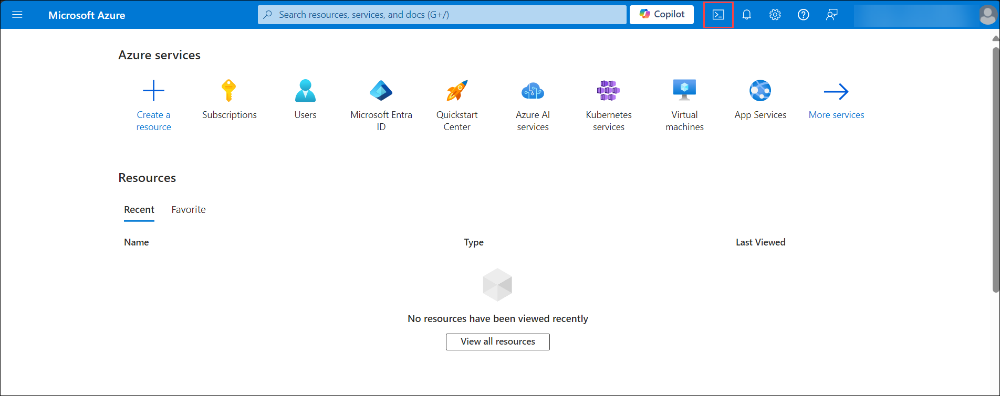
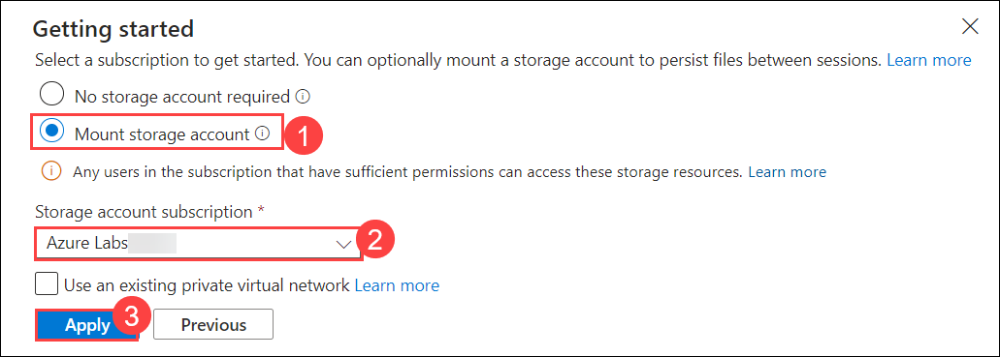
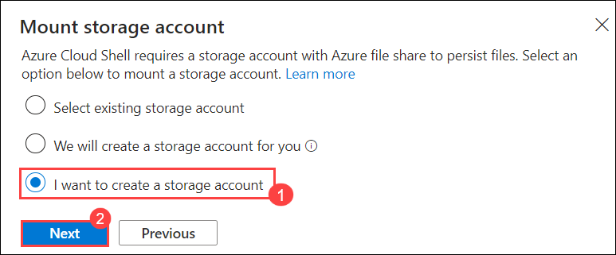
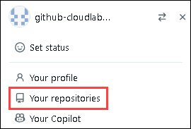
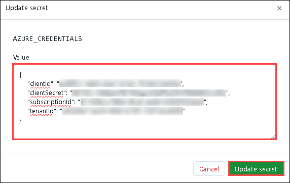
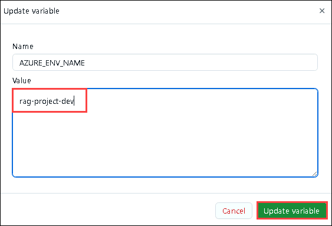
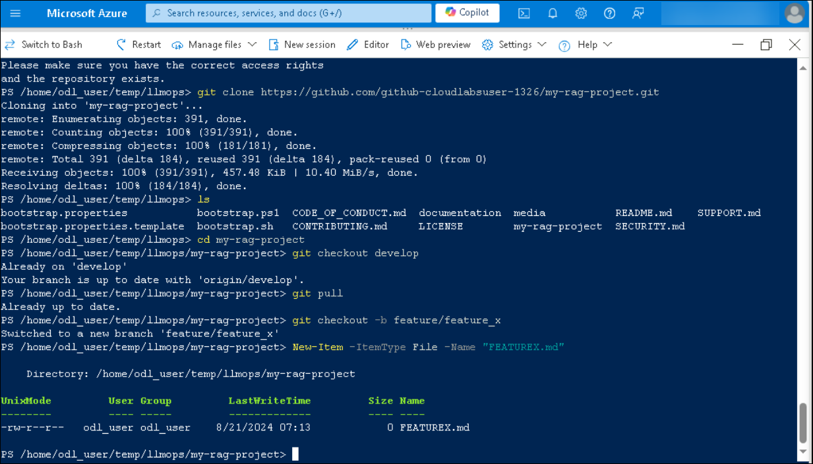

# Lab 05: Automating

### Estimated Duration: 60 minutes

## Overview
Participants will monitor the process of bootstrapping a new project, which involves setting up the initial structure, tools, and processes needed to begin development, including defining project goals, configuring the environment, managing dependencies, and establishing the codebase. Once the project is underway, they will oversee the delivery of a new feature, ensuring requirements are gathered, the feature is designed for seamless integration, implemented with quality code, thoroughly tested, and successfully deployed to production, all while updating documentation and communicating changes to stakeholders.

## Lab Objectives

After completing this lab, you will be able to complete the following tasks:

- Exercise 01: Bootstrapping a New Project
- Exercise 02: Delivering a New Feature

## Exercise 01: Bootstrapping a New Project

In this section, you will learn how to start a new project using a project template. The bootstrapping process will create a new project repository on GitHub and populate it with content from the project template. Additionally, it will set up the development environment for your project, ensuring that you have everything you need to get started quickly and efficiently.

### Task 01: Steps to Bootstrap a Project

1. Open **Azure Portal**, select **Cloud Shell** from the top of the menu.

    

1. On the **Welcome to Azure Cloud Shell** pop-up select **PowerShell**.

    

1. On the **Getting Started** pop-up select the following options to create the storage account:

    - Select **Mount storage account (1)**
    - Subscription: **Select your subscription (2)**
    - Select **Apply (3)**

        

1. On **Mount storage account** pop-up, select **I want to create a storage account (1)**. Select **Next (2)**.
     
   

1. On the **Create storage account** pop-up, enter all the details:-
     
     - Subscription: Select the subscription (1)
     - Resource group: Select **llm-ops-<inject key="Deployment-ID" enableCopy="false"/> (2)**
     - Region: Select **<inject key="location" enableCopy="false"/> (3)**
     - Storage account name: Enter **blob<inject key="Deployment-ID" enableCopy="false"/> (4)**
     - File share: Enter **fs<inject key="Deployment-ID" enableCopy="false"/> (5)**
     - Select **Create (6)**

          .png)

1. Clone the repository from GitHub into a temporary directory:

   ```sh
    mkdir temp
    cd temp
    git clone https://github.com/azure/llmops
   ```

1. Define Properties for Bootstrapping. Go to the `llmops` directory.

   ```sh
    cd llmops
   ```

1. Create a copy of the `bootstrap.properties.template` file with this filename `bootstrap.properties`.

    ```sh
    cp bootstrap.properties.template bootstrap.properties
    ```

1. Open the `bootstrap.properties` with a text editor and update it with the following information:

    ```sh
    code .
    ```

   >**Note:** Switch to Classic Powershell when prompted.
   
1. Add the following details inside the code editor:

   - **GitHub Repo Creation (related to the new repository to be created)**

    | Settings | Values |
    |  -- | -- |
    | `github_username` | Your GitHub **username** |
    | `github_use_ssh` | Set **false**|
    | `github_template_repo` | The project template repository, enter **azure/llmops-project-template** |
    | `github_new_repo` | The bootstrapped project repo to be created, enter **githubusername/my-rag-project** |
    | `github_new_repo_visibility` | Visibility of the new repository, choose **public** |

     >**Note:** Kindly use your personal GitHub account and username.

    - **Dev Environment Provision Properties**

    | Settings | Values |
    |  -- | -- |      
    | `azd_dev_env_provision` | Set to **true** to provision a development environment |
    | `azd_dev_env_name` | The name of the development environment, enter **rag-project-dev** |
    | `azd_dev_env_subscription` |  Your **subscription ID** |
    | `azd_dev_env_location` | The Azure region for your dev environment, enter <inject key="Location"></inject> |

1. Authenticate with Azure and GitHub and log in to Azure CLI:

   ```sh
   az login
   ```
   >**Note:** When prompted, open the link and select your account.

1. Log in to Azure Developer CLI:

        ```sh
        azd auth login
        ```
   >**Note:** When prompted, open the link and select your account.

1. Log in to GitHub CLI:

        ```sh
        gh auth login
        ```
1. After running the above command, follow the steps that are mentioned in the Azure CLI to complete the authentication:
   
   - **What account do you want to log into?**:  select **GitHub.com**
   - **What is your preferred protocol for Git operations?**: select **HTTPS**
   - **Authenticate Git with your GitHub credentials?**: select **Yes**
   - **How would you like to authenticate GitHub CLI?**: select **Login with a web browser**
   - First, copy your one-time code
   - Press Enter to open github.com in your browser. 
   - Press **CTRL and Click** on the following link: https://github.com/login/device.
   - On the **Device Activation** page, select **Continue**.

        

   - Paste the activation code that you copied from the Azure CLI page.
   - On the **Authorize GitHub CLI** page, select **Authorize github**.
   - Navigate back to the **Azure CLI** you'll see that you are logged in.

1. Run the following command to run the Bootstrap Script.

    ```PowerShell
    .\bootstrap.ps1
    ```

1. Navigate back to your github account. Click on the profile, click on **Your repositories** and select the repository **my-rag-project**.

   

   

1. Inside **my-rag-project** repository, click on **Settings (1)** and click on **Environments (2)** from the left pane. You will notice that three environments have already been created - **prod**, **qa**, and **dev** **(3)**.

   

1. Click on **prod**. Scroll down and pause when you reach **AZURE_CREDENTIALS** secret under **Environment secrets** section. Click on it and paste the following format as follows, and update the values according to it:
    
   ```json
   {
       "clientId": "your-client-id",
       "clientSecret": "your-secret-key",
       "subscriptionId": "your-subscription-id",
       "tenantId": "your-tenant-id"
   }
   ```

    

   

   >**Note:** You can find all the values on the **Environment tab > Service Principal Details** section.

   

1. After updating Azure Credentials, navigate back and scroll down to update the following **environment variables** with the respective values.
   
    | **Environment Variables**| Values |
    |------------|------------|
    | `AZURE_ENV_NAME`| rag-project-dev| 
    | `AZURE_LOCATION`| <inject key="location" enableCopy="false"/>|
    | `AZURE_SUBSCRIPTION_ID`| your-subscription-id|

    

1. Follow the step 18 and 19 for **qa** and **dev** environments.

## Exercise 02: Delivering a New Feature

Once the project bootstrapping is complete, the team can begin developing new features. This section provides a detailed guide on delivering a new feature, covering every step from initial development to production deployment. To illustrate the procedure, we will develop a new feature called "Feature X," which will be included in the project's release 1.0.0. The process can be summarized in six steps, represented in the following diagram, making it easier to understand and follow along.


Follow the steps below to deliver this feature from the beginning of development to deployment in production. You will need access to your project repository that has been bootstrapped, a terminal (bash or PowerShell) with Git, and the GitHub page of your repository.

### Task 01: Start Cloning Your Project

1. Use a command like the one below to clone your bootstrapped project repository.

    ```bash
    git clone https://github.com/github-cloudlabsuser-xxxx/my-rag-project.git
    cd my-rag-project
    ```

    >**Note:** Replace xxxx with your GitHub username.

### Task 02: Creating a Feature Branch

The workflow starts by creating a feature branch named `feature/feature_x` from the `develop` branch. This is where the development team will work on the new feature X.

1. Switch to the `develop` branch and pull the latest changes:

    ```bash
    git checkout develop
    git pull
    ```

1. Create the feature branch:

    ```bash
    git checkout -b feature/feature_x
    ```

1. Make non-disruptive changes to the repository. For instance, create a file `FEATUREX.md` in the project root:

    ```PowerShell
    New-Item -ItemType File -Name "FEATUREX.md"
    ```

    

### Task 03: Pull Request (PR) to `develop`

Upon completing the feature, create a Pull Request (PR) to merge changes from the feature branch `feature/feature_x` to the `develop` branch, which is the default branch where the team integrates changes.

1. Add changes, commit, and push to the feature branch:

    ```bash
    git add .
    git config --global user.email "enter your github user e-mail"
    git commit -m "Feature X complete"
    git push origin feature/feature_x
    ```

1. Create the PR:

    ```bash
    gh pr create --base develop --head feature/feature_x --title "Feature X" --body "Description of the changes and the impact."
    ```

1. Press **CTRL and Click** on the URL to be redirected to the GitHub page. Wait for all the pipelines to succeed.

    

### Task 04: Merge to `develop`

Approve the Pull Request, merging it into the `develop` branch. This merge triggers the Continuous Integration (CI) Pipeline, which builds the orchestration flow and conducts AI-assisted evaluations using a comprehensive test dataset based on the [Golden Dataset](https://aka.ms/copilot-golden-dataset-guide). Upon successful completion, the Continuous Deployment (CD) Pipeline is executed to deploy the flow to the **dev** environment.

1. Merge the PR using GitHub: Go to the Pull Requests tab in your repository, select the recently created PR, and click on **Merge pull request**, and select **Confirm merge**.

    

### Task 05: Release Branch (`release/1.0.0`)

After confirming the stability of the `develop` branch through testing in **dev**, create a release branch `release/1.0.0` from `develop`. This triggers a *Continuous Deployment (CD) pipeline* to deploy the application to the **qa** environment. Before deployment, an AI-based evaluation assesses [quality](https://learn.microsoft.com/en-us/azure/ai-studio/how-to/develop/flow-evaluate-sdk), risk and [safety](https://learn.microsoft.com/en-us/azure/ai-studio/how-to/develop/simulator-interaction-data) evaluation. The application in **qa** is then used for User Acceptance Testing (UAT) and [red-teaming](https://learn.microsoft.com/en-us/azure/ai-services/openai/concepts/red-teaming) ou LLM App.

1. Navigate back to the tab where Azure CLI is opened. Now, Create the release branch:

    ```bash
    git checkout develop
    git pull origin develop
    git checkout -b release/1.0.0
    git push origin release/1.0.0
    ```

### Task 06: Pull Request to `main`

After UAT tests in the **qa** environment confirm that the application is ready for production, create a Pull Request (PR) to merge the changes into the `main` branch from the `release/1.0.0` branch.

1. Create the PR: Below is an example utilizing the GitHub CLI:

    ```bash
    gh pr create --base main --head release/1.0.0 --title "Release 1.0.0" --body "Merging release/1.0.0 into main after successful UAT in QA environment"
    ```

    >**Note:** You can also use the GitHub website to create the pull request. Remember to select `main` as the base branch and `release/1.0.0` as the compare branch.

1. Press **CTRL and Click** on the URL to be redirected to the GitHub page. Wait for all the pipelines to succeed.

1. Once the Pull Request (PR) to the `main` branch is approved on GitHub, and click on **Merge pull request** to manually approve the merge of `release/1.0.0` into the `main` branch. This action triggers the Continuous Deployment (CD) pipeline, which deploys the code to the **prod** environment.

## Summary

In this lab, you have performed the following tasks:

- Bootstrapped a New Project
- Delivered a New Feature

### You have successfully completed the lab.
